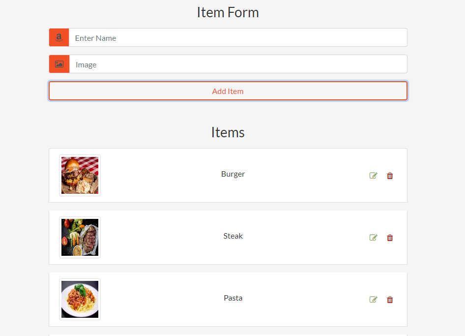

# Project: Practicing with API

This is a practice project on fetching data from the API, posting new data and also editing data using HTTP methods. The app uses the old way of XMLHttpRequest method to fetch data. I have created my own JSON file that is stored on this <a href="https://mockapi.io/">Mock API website</a> and created my end points from it. 

So far the JSON file has these items to play around with: burger, burrito, cake, default, pancake, pasta, salad, salmon and steak. So you can add, edit and delete these items with their images. In place of inputting images, you just write the name of the item, and automatically, it will display the image file of the item required.

## Built With

- HTML
- CSS
- Javascript
- Webpack

## Live Version

[Live Link](https://emmanuelkamala.github.io/httpMethods/)

## Getting Started

Open your terminal or text editor and use next command

        git clone https://github.com/emmanuelkamala/httpMethods.git

        cd httpMethods

After if you want to do any changes please create new branch, after changes open pull request.
Happy coding! 

## Author

👤 **Author**

- Github: [emmanuelkamala](https://github.com/emmanuelkamala)
- Twitter: [ejkamala](https://twitter.com/ejkamala)
- Linkedin: [emmanuelkamala](https://linkedin.com/in/emmanuelkamala)

## 🤝 Contributing

Contributions, issues and feature requests are welcome!

Feel free to check the [issues page](issues/).

## Show your support

Give a ⭐️ if you like this project!

## Acknowledgments

- The odin project
- Microverse tips

## 📝 License

This project is [MIT](lic.url) licensed.
